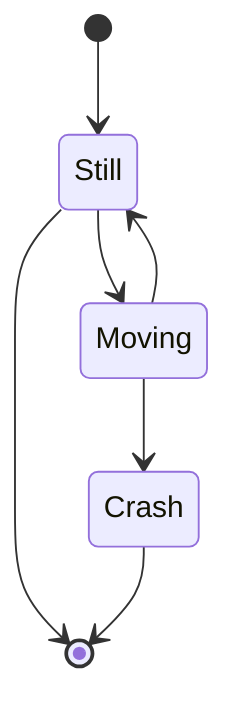
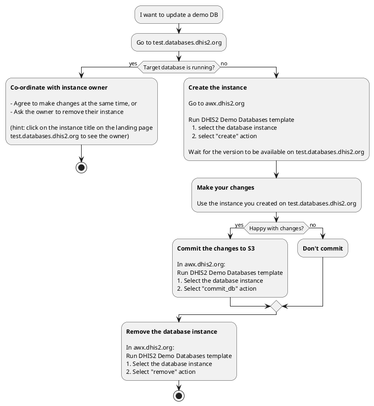

testing stuff

## Mermaid

```mermaid

stateDiagram
[*] --> Still
Still --> [*]
Still --> Moving
Moving --> Still
Moving --> Crash
Crash --> [*]

```

## Plantuml

```plantuml

@startuml

:I want to update a demo DB;


:Go to test.databases.dhis2.org;


if (Target database is running?) then (yes)
  :**Co-ordinate with instance owner**

  - Agree to make changes at the same time, or
  - Ask the owner to remove their instance

  (hint: click on the instance title on the landing page
  test.databases.dhis2.org to see the owner);
  stop
else (no)
  :**Create the instance**

  Go to awx.dhis2.org

  Run DHIS2 Demo Databases template
    1. select the database instance
    2. select "create" action

  Wait for the version to be available on test.databases.dhis2.org;

  :**Make your changes**

  Use the instance you created on test.databases.dhis2.org;

  if (Happy with changes?) then (yes)
    :**Commit the changes to S3**

    In awx.dhis2.org: 
    Run DHIS2 Demo Databases template
    1. Select the database instance
    2. Select "commit_db" action;
  else (no)
    :**Don't commit**;
  endif
endif

:**Remove the database instance**

In awx.dhis2.org: 
Run DHIS2 Demo Databases template
1. Select the database instance
2. Select "remove" action;

stop

@enduml
```
